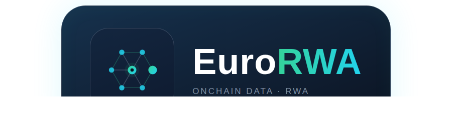

<p align="center">
  
</p>

<h1 align="center">EuroRWA</h1>

<p align="center">
  <b>Tokenized money market funds — on-chain verifiable.</b><br>
  An AI agent pipeline that snapshots EU + US tokenized money market funds, signs every snapshot on-chain, and drafts the daily report.
</p>

<p align="center">
  <a href="https://rwa-dashboard-gamma.vercel.app">Live dashboard</a> ·
  <a href="https://sepolia.etherscan.io/address/0xd482a715cdef4073593f4a3208abd328f6d71725">On-chain attestation</a>
</p>

---

## What it does

Every 12 hours, the system:

1. **Scrapes** public data across 15 EU + US tokenized money market funds — USYC, BUIDL, USDY, eurSAFO, EUTBL and more.
2. **Computes** TVL, APY, holders, and 7 / 30 / 90-day flows into a SQLite snapshot.
3. **Signs** each snapshot — hashed with keccak-256 and published to a smart contract on **Sepolia**, permanent and tamper-proof.
4. **Analyzes** with an AI agent (BUY / HOLD / SELL) using news, on-chain flows, and macro context.
5. **Delivers** the daily report summary to Telegram.

Anyone can re-hash the data and verify the on-chain signature — no "trust me" dashboards.

## Stack

| Layer    | Tech                              |
| -------- | --------------------------------- |
| Runtime  | TypeScript · Bun                  |
| On-chain | Viem · Solidity · Sepolia         |
| Data     | SQLite · rwa.xyz API              |
| API      | Hono                              |
| Frontend | React · Vite · Recharts           |
| AI       | Google Gemini (free tier)         |
| Bots     | Telegram (long-polling + webhook) |

## Repo layout

```
src/fetch.ts          # snapshot scraper (rwa.xyz)
src/ingest.ts         # snapshot → SQLite
src/analyst/          # AI agent: news / flow / macro + BUY-HOLD-SELL
src/agent/            # on-chain attestation (deploy / sign / verify / publish)
src/frontend/         # dashboard web app
api/                  # Hono API + Telegram bot entrypoints
scripts/              # cron pipeline, LinkedIn assets, NFT mint
data/                 # snapshots, agent wallet, attestation store
docs/                 # LinkedIn guide, monetization research, posts
```

## Verify an attestation

```bash
bun run verify            # latest snapshot
bun run verify -- 2026-08-06   # a specific date
```

Verifies the payload hash matches the published keccak-256 and that the recovered signer is the EuroRWA agent wallet.

## Status

- [x] Data pipeline (15 funds, 12h cadence, trend columns)
- [x] On-chain attestation on Sepolia
- [x] AI analyst with 30/90d trend awareness
- [x] Telegram delivery
- [x] Live dashboard + on-chain verified NFT avatar
- [ ] Public Telegram data bot (in progress)

---

## Contact

- Telegram data bot: https://t.me/EuroRWA_Data_bot
- Telegram build bot (commissions): https://t.me/EuroRWA_Build_2026_bot

MIT © 2026 — data sourced from rwa.xyz public APIs. Not financial advice.
